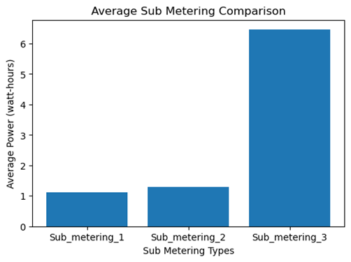

# Household Power Consumption Analysis

## Project Overview
This project analyzes household power consumption data from the UCI Machine Learning Repository. It explores power usage patterns, focusing on global active power and sub-metering values. The goal is to demonstrate data analysis and visualization skills using Python.

## It includes
- Data cleaning and preprocessing
- Statistical summary
- Hourly usage trend analysis
- Sub-metering comparison
- Mouthly power consumption trends

## Dataset
The dataset used is sourced from the [UCI Machine Learning Repository](https://archive.ics.uci.edu/ml/datasets/individual+household+electric+power+consumption). It contains measurements of global active power, voltage, and sub-metering for household appliances.

## Technologies Used
- **Python 3**
- **Pandas**: Data manipulation and cleaning
- **Matplotlib**: Data visualization

## Visualization
Here’s the bar chart comparing the average power consumption across different sub-metering channels:

## Conclusion
This project demonstrates basic data analysis and visualization techniques, showing how power usage varies across different sub-metering channels.
